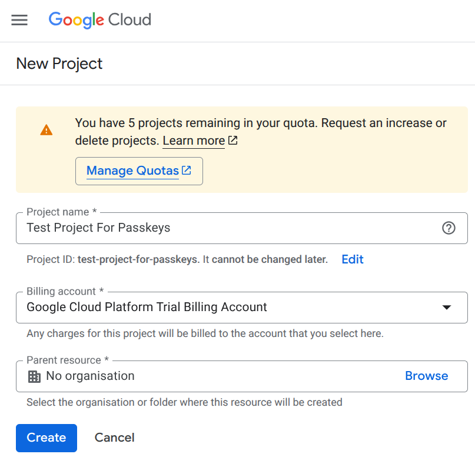
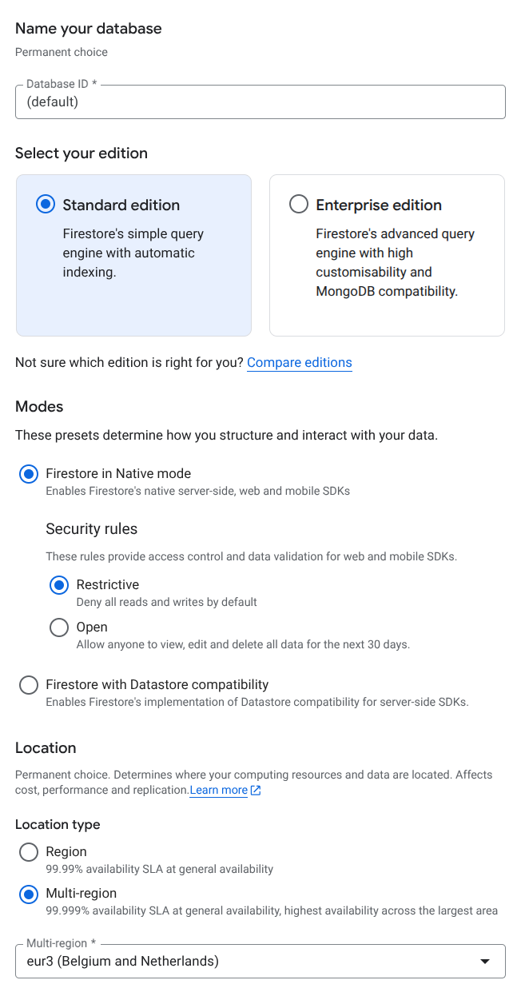
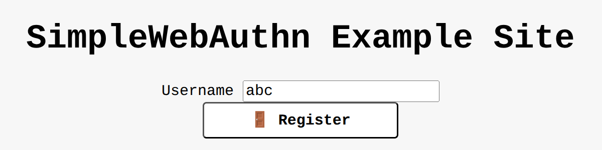
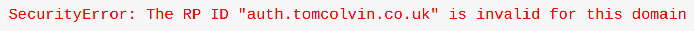

## Back end Google Cloud / SimpleWebAuthn

1. Install the Google Cloud CLI: [https://docs.cloud.google.com/sdk/docs/install-sdk](https://docs.cloud.google.com/sdk/docs/install-sdk)  
2. Install the Docker Engine: [https://docs.docker.com/engine/install/](https://docs.docker.com/engine/install/)  
3. Run `gcloud auth login`
4. Run `gcloud auth configure-docker gcr.io` - this configures your local Docker instance to use gcloud’s auth  
5. Create a Google Cloud project: [console.cloud.google.com](http://console.cloud.google.com), giving it the billing account you created using the link  
    
6. You’ll need a Firestore database. Follow the instructions here to enable the Firestore API and create a database: [https://console.cloud.google.com/firestore/databases](https://console.cloud.google.com/firestore/databases)
7. Run `docker build -t gcr.io/[YOUR PROJECT ID]/passkey-auth-demo:latest .`
8. Run `docker push gcr.io/[YOUR PROJECT ID]/passkey-auth-demo:latest` 
   You’ll probably get a link to enabling the artifact registry API the first time. If so, enable the API and retry the command.  
9. Deploy the container to Cloud Run:  
   `gcloud run deploy passkey-auth-demo --image gcr.io/[YOUR PROJECT ID]/passkey-auth-demo:latest --platform managed --region europe-west4 --allow-unauthenticated --project [YOUR PROJECT ID]`
10. After deployment, you’ll see a URL. Go to that URL to see your passkey server running nicely.  
11. Let’s try out the web interface. Enter a username, and hit Register:  
    
12. Uh oh! 
    Fix this by going to the Cloud Run console and deploying a new version of your service with an environment variable:  
    Name: RP_ID  
    Value: your function’s domain name
13. Now, update your Android app to point to your new passkeys domain!
